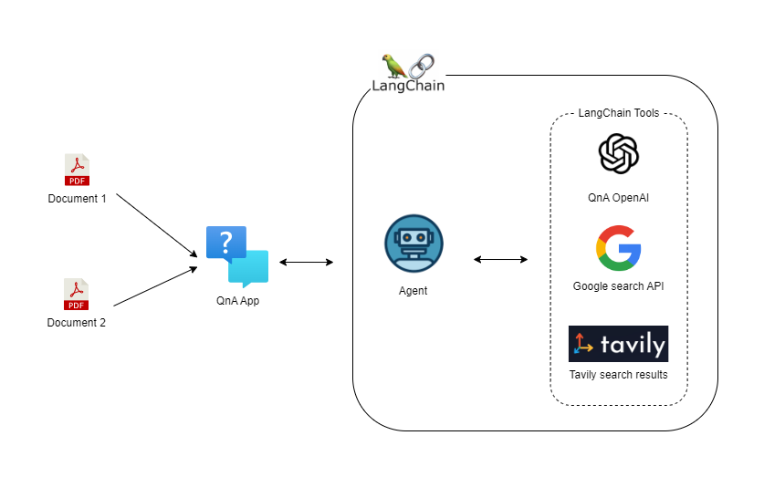

# llm-document-analysis
Integrating LangChain with ChatGPT and search engines such as Google and Tavily

This project utilises LangChain agents to extend the capabilities of language models by integrating various LangChain tools. 

- These tools help overcome the knowledge limitations of language models by providing access to up-to-date information with external services such as Google Search, Tavily, custom APIs, and more. 
- LangChain agents ensure that the language model can retrieve and incorporate the most current data, enhancing its accuracy and relevance.

## QnA Application with LangChain Agents and Tools

List of LangChain default tools:
https://python.langchain.com/v0.1/docs/integrations/tools/

 

